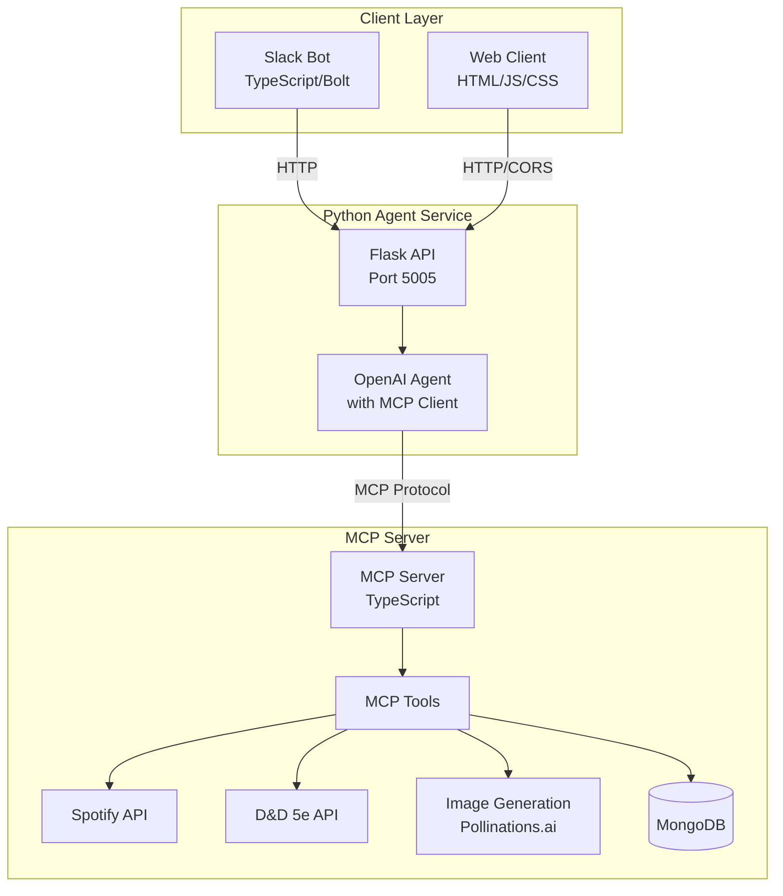

# TTRPG Campaign Assistant 🎲

A comprehensive tabletop role-playing game (TTRPG) assistant that combines AI-powered campaign management, image generation, and ambient music discovery. Built with Model Context Protocol (MCP) for seamless integration with AI assistants.

## 🌟 Features

- **Campaign Management**: Track campaign logs, characters, and story progression
- **AI-Powered Content Generation**: Generate character images, backgrounds, and encounter scenes
- **Ambient Music Discovery**: Search and play atmospheric music via Spotify integration
- **Multi-Interface Support**: Access via Slack bot or web interface
- **D&D 5e Integration**: Fetch monster data and generate custom monster images

## 🏗️ Architecture



## 📦 Project Structure

```
MCP_Hackathon/
├── mcp_server/          # MCP Server (TypeScript)
│   ├── src/
│   │   ├── server.ts    # Main MCP server
│   │   ├── gpt.ts       # Image generation client
│   │   ├── spotify/     # Spotify integration
│   │   └── db/          # MongoDB schemas
│   └── package.json
│
├── mcp_client/          # Client Applications
│   ├── src/
│   │   └── main.ts      # Slack bot & web server
│   ├── py_src/
│   │   └── main.py      # Python agent service
│   └── package.json
│
└── web/                 # Web Interface
    ├── index.html
    ├── styles.css
    └── script.js
```

## 🛠️ MCP Tools Available

### Campaign Management
- `ttrpgmcp_create_campaign_log` - Create campaign log entries
- `ttrpgmcp_get_last_campaign_log` - Retrieve the latest log
- `ttrpgmcp_create_logs_summary` - Generate AI summaries of recent sessions

### Image Generation
- `ttrpgmcp_create_background_image` - Generate atmospheric backgrounds
- `ttrpgmcp_create_character_image` - Create character portraits with style options
- `ttrpgmcp_get_monster_and_create_image` - Fetch D&D monster data and generate custom art

### Music & Ambiance
- `ttrpgmcp_search_in_spotify` - Search for atmospheric tracks
- `ttrpgmcp_play_in_spotify` - Play tracks directly in Spotify

### D&D 5e Integration
- `ttrpgmcp_get_monster_description` - Get monster stats and abilities
- `ttrpgmcp_get_monster_image` - Fetch official monster artwork

## 🚀 Getting Started

### Prerequisites
- Node.js 18+ and npm/pnpm
- Python 3.13+
- MongoDB instance
- Spotify Developer Account (for music features)
- OpenAI API key (for AI features)
- Slack App (for Slack bot)

### Installation

1. **Clone the repository**
   ```bash
   git clone https://github.com/yourusername/MCP_Hackathon.git
   cd MCP_Hackathon
   ```

2. **Set up the MCP Server**
   ```bash
   cd mcp_server
   npm install
   cp .env.example .env  # Configure your environment variables
   ```

3. **Set up the Client**
   ```bash
   cd ../mcp_client
   pnpm install
   cd py_src
   uv sync  # Install Python dependencies
   cd ..
   cp .env.example .env  # Configure your environment variables
   ```

4. **Configure Environment Variables**

   MCP Server `.env`:
   ```env
   OPENAI_API_KEY=your_openai_key
   SPOTIFY_CLIENT_ID=your_spotify_client_id
   SPOTIFY_CLIENT_SECRET=your_spotify_client_secret
   MONGODB_URI=your_mongodb_uri
   ```

   Client `.env`:
   ```env
   SLACK_BOT_TOKEN=your_slack_bot_token
   SLACK_SIGNING_SECRET=your_slack_signing_secret
   SLACK_APP_TOKEN=your_slack_app_token
   AGENT_SERVICE_URL=http://localhost:5005
   OPENAI_API_KEY=your_openai_key
   WEB_PORT=8080
   ```

### Running the Application

1. **Start everything with one command** (from mcp_client directory):
   ```bash
   npm run dev
   ```

   This will:
   - Start the Python agent service on port 5005
   - Start the web server on port 8080
   - Start the Slack bot on port 3000

2. **Access the interfaces**:
   - Web UI: http://localhost:8080
   - Slack: Add the bot to your workspace and message it
   - Python API: http://localhost:5005/health

## 💬 Usage Examples

### Web Interface
1. Open http://localhost:8080
2. Type questions like:
   - "Generate an image of a dark elf ranger"
   - "Find ambient music for a tavern scene"
   - "Create a forest background for our next encounter"

### Slack Bot
Message the bot directly or mention it in a channel:
```
@ttrpg-assistant create an image of a dragon's lair
@ttrpg-assistant find battle music
@ttrpg-assistant summarize our last campaign session
```

## 🔧 API Endpoints

### Python Agent Service
- `POST /process_sync` - Process questions with AI agent
  ```json
  {
    "question": "Generate an image of a wizard tower"
  }
  ```

- `GET /health` - Check service status

## 🎨 Image Generation

The system uses Pollinations.ai for image generation with customizable parameters:
- **Styles**: realistic, fantasy-art, anime, cartoon, medieval
- **Types**: portrait, full-body, token
- **Themes**: dark, heroic, atmospheric

## 🎵 Music Integration

Spotify integration allows:
- Searching by mood: "dark tense music", "peaceful forest ambiance"
- Playing tracks, albums, and playlists
- Embedded players in web interface

## 📝 Campaign Logs

Campaign logs are stored as JSON with:
- Title and content
- Date and timestamps
- AI-generated summaries
- Persistent storage

## 🤝 Contributing

1. Fork the repository
2. Create a feature branch (`git checkout -b feature/amazing-feature`)
3. Commit your changes (`git commit -m 'Add amazing feature'`)
4. Push to the branch (`git push origin feature/amazing-feature`)
5. Open a Pull Request

## 📄 License

This project is licensed under the MIT License - see the LICENSE file for details.

## 🙏 Acknowledgments

- Built with [Model Context Protocol (MCP)](https://modelcontextprotocol.io/)
- Image generation powered by [Pollinations.ai](https://pollinations.ai/)
- D&D data from [D&D 5e API](https://www.dnd5eapi.co/)
- Music integration via [Spotify Web API](https://developer.spotify.com/)


## How to run 
`cd mcp_client && pnpm run dev`